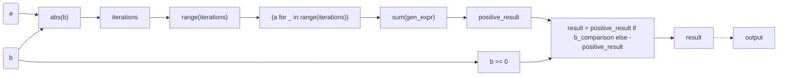
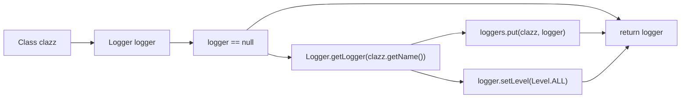
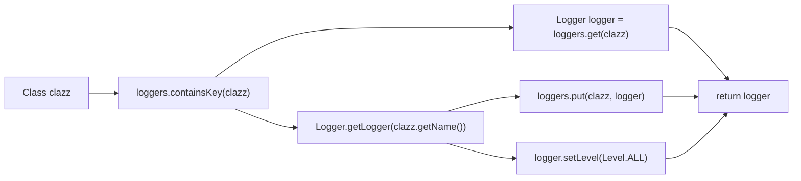

1

['1', '4', '6', '7', '13', '14', '18', '19', '28', '30', '31', '33', '36', '38', '39', '45', '49']

<plugin>
  <groupId>org.pitest</groupId>
  <artifactId>pitest-maven</artifactId>
  <version>1.13.0</version>
</plugin>

mvn test-compile org.pitest:pitest-maven:mutationCoverage

first mark the line number for each line of code, like below:

public class App //line-1:
{ // line-2:
public static void main( String[] args ) // line-3:
    { // line-4:
    System.*out*.println( "Hello World!" );// line-5:
	} //line-6:
} // line-7:

ok, reasoning this code line by line, starting from the main method,  when the parse method is called inside the main method, jump into it and keep reasoning the parse method line by line, then jump out and keep  going on. You should perform like a Java Debugger and try to estimate  each internal variable

output in this format:

main: line-xx: (what it does, and what may be the variable value here)
....
main: line-yy : jump into parse
parse: line-xx: ...
parse: line-yy: jump back to main method
